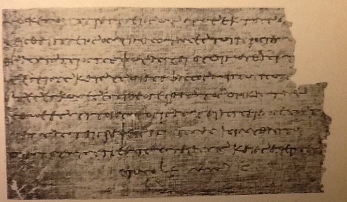

# Papyru

  
  
  **크로스 플랫폼 노트 테이킹 어플리케이션**
  
  

## ✨ 소개

Papyru는 Tauri와 React를 기반으로 한 크로스 플랫폼 노트 테이킹 어플리케이션입니다. Rust의 성능과 안정성, React의 유연한 UI를 결합하여 빠르고 직관적인 노트 작성 경험을 제공합니다.

## 🚀 주요 기능 (예정)

- 📝 **리치 텍스트 에디터**: 마크다운 지원으로 구조화된 노트 작성
- 🔍 **빠른 검색**: 전문 검색으로 원하는 노트를 즉시 찾기
- 🏷️ **태그 시스템**: 노트를 체계적으로 분류하고 관리
- 💾 **로컬 저장소**: SQLite 기반의 안전한 데이터 보관
- 🌙 **다크 모드**: 눈에 편한 테마 지원
- 🖥️ **크로스 플랫폼**: Windows, macOS, Linux 지원

## 🛠️ 기술 스택

- **Frontend**: React 18 + TypeScript + Vite
- **Backend**: Rust + Tauri 2.0
- **Database**: SQLite (예정)
- **Styling**: TailwindCSS v4
- **Package Manager**: pnpm

## 📋 필수 조건

- [Node.js](https://nodejs.org/) (18.0.0 이상)
- [Rust](https://rustup.rs/)
- [pnpm](https://pnpm.io/)

**개발 예정:**

- 🔄 노트 CRUD 시스템
- 🔄 SQLite 데이터베이스 연동
- 🔄 TailwindCSS 스타일링
- 🔄 리치 텍스트 에디터
- 🔄 검색 및 태그 기능

  

  ❤️ Tauri + React

